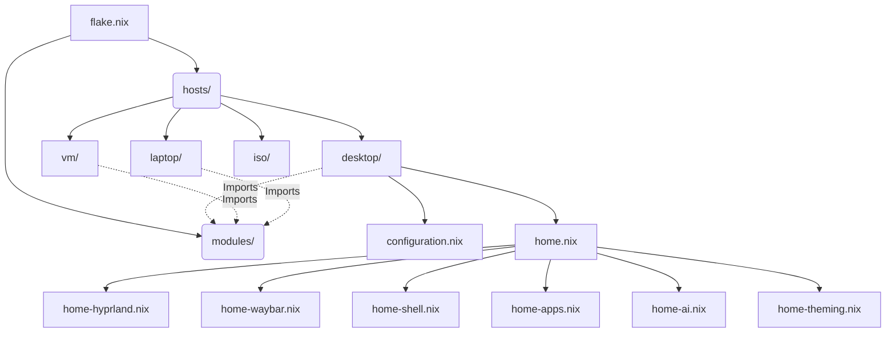

# NixOS Configuration

A modular, multi-host NixOS configuration with a unified Home Manager userland (Hyprland, Waybar, Nushell).

## Structure



## Modules

System-level modules shared across hosts:
* **`ai.nix`**: Ollama, Open-WebUI, SearxNG
* **`apps.nix`**: GUI applications and default tools
* **`audio-production.nix`**: Bitwig, PipeWire plugins, yabridge
* **`boot.nix`**: Systemd-boot and initrd config
* **`desktop.nix`**: Base graphical environment, fonts, portals
* **`hardware.nix`**: Bluetooth, RGB, controllers
* **`kernel.nix`**: Custom Xanmod kernel with Zen3 LTO optimization
* **`locale.nix`**: Timezone and language defaults
* **`networking.nix`**: Firewall, Tailscale, Syncthing
* **`nix-settings.nix`**: Flake enablement, substituters, nh, GC
* **`performance.nix`**: BBR, ZRAM, ananicy, gamemode
* **`services.nix`**: SSH, Docker, Podman, GNOME services
* **`shell.nix`**: Base shell environment
* **`systemd-minimal.nix`**: Boot speed optimizations
* **`user.nix`**: User account, groups, shell assignment
* **`vpn.nix`**: OpenVPN network namespace and qBittorrent

## Deployment

Deploy using `nh` (Nix Helper):

```bash
# Dry run the desktop config
nh os build /etc/nixos

# Apply and switch immediately
nh os switch /etc/nixos
```
