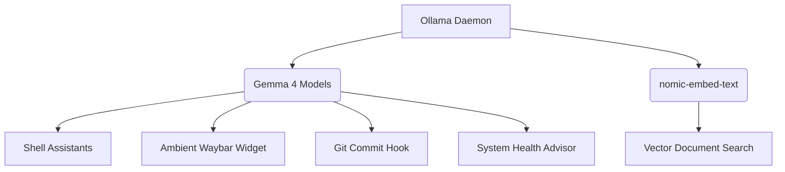

# Ambient AI Integration Suite

This manual details the local, background-first AI features running via Ollama and AMD ROCm on the RX 6700 XT.

> [!NOTE]
> All AI workloads run entirely locally and proactively in the background, utilizing tiered Gemma 4 models depending on the required latency and complexity.

## AI Infrastructure

*   **Ollama Daemon**: Accelerated using `HSA_OVERRIDE_GFX_VERSION="10.3.0"`. Configured with `OLLAMA_NUM_PARALLEL=2` for concurrent requests.
*   **SearXNG**: Local meta-search engine running on `127.0.0.1:8888`. Used as a secure fallback and RAG web search backend.
*   **Open-WebUI**: Hosted on `127.0.0.1:11111`, enabling UI access to RAG, web search, and chat.

## Model Tiering Strategy

> [!TIP]
> The system automatically routes queries to the optimal model based on latency limits.

| Tier | Quantized Model | Latency | Assigned Tasks |
| :--- | :--- | :--- | :--- |
| **E2B** (Fast) | `Huihui-gemma-4-E2B` | ~1 sec | Smart Clipboard, Waybar widget, Health Advisor, Spotlight Fallback |
| **E4B** (Balanced) | `Huihui-gemma-4-E4B` | ~3 sec | Git Commit Hook, Auto-Organizer, Notification Digest |
| **12B** (Deep) | `Huihui-gemma-4-12B` | ~8 sec | Interactive Rofi AI, `ai-papa`, `ai-debug` log diagnosis |

## Ambient Services

### 📋 Smart Clipboard
Analyzes copied text and offers contextual Rofi actions (e.g., summarize prose, explain code, diagnose error) before executing and re-copying the modified text.

### 🩺 System Health Advisor
Runs every 5 minutes (`ai-health-advisor.timer`).
*   **Behavior**: Silently monitors RAM (>85%), Disk (>90%), CPU Temp (>85°C), and Load.
*   **Action**: If thresholds breach, queries the E2B model with `ps aux` output for a 1-sentence diagnostic toast.

### 📁 Smart File Auto-Organizer
Watches `~/Downloads` via `inotifywait`.
*   **Behavior**: Fast-paths known extensions (e.g., `.pdf` to `Documents/PDFs`).
*   **Action**: Ambiguous files are routed to the E4B LLM for JSON categorization. Supports manual undo via `ai-organize --undo`.

### ✨ Waybar AI Widget
Rotates every 300 seconds. Injects system context (RAM, disk, uptime) into a prompt requesting a tip, quote, or system observation.

### 🔔 Notification Digest
Runs every 30 minutes. Compiles unread `swaync` notifications into an executive summary via the E4B model.

### 📝 AI Conventional Commit Hook
Triggered automatically on `git commit`. Uses the E4B model to generate standard `type(scope): description` commit messages from staged diffs.

### 🔍 Spotlight Search Fallback
Pressing `SUPER+D` prioritizes apps and files. If no matches are found, it transparently queries the E2B model for a quick answer before falling back to SearXNG web search.

## Shell Helper Commands

> [!TIP]
> Add `ai` before your questions in Nushell for instant help.

*   `ai <prompt>`: Fast shell assistant (E2B).
*   `ai-task <prompt>`: Code assistant (E4B).
*   `ai-papa <prompt>`: Deep architectural analysis (12B).
*   `ai-debug`: Fetches recent `journalctl` errors and queries the 12B model for root cause fixes.
*   `git-ai`: Interactive commit generator.
*   `vector-search <query>`: Queries embedded local file index.
*   `pdf-qa <file.pdf> <question>`: Runs local RAG against PDF text.
