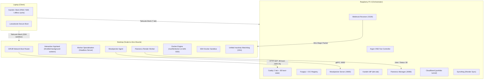

# Scale-to-Zero Homelab — Deployment Manual

This manual provides complete step-by-step instructions for provisioning, configuring, and verifying the autonomous, scale-to-zero serverless homelab across the **Raspberry Pi 4** (always-on orchestrator), **Desktop** (scale-to-zero compute muscle), and **Laptop** (mobile client).

---

## Architecture Overview



---

## 1. Prerequisites & Tailnet Setup

Before starting the node-level deployments, set up your private **Tailscale** overlay network. Tailscale provides end-to-end WireGuard encryption and MagicDNS across all nodes, cleanly traversing CGNAT and firewalls without opening external router ports.

### 1.1 Creating and Configuring Your Tailnet

1. **Sign Up**: Create an account at [login.tailscale.com](https://login.tailscale.com) using your identity provider (GitHub, Google, etc.).
2. **Enable MagicDNS**:
   - In the Tailscale Admin Console, navigate to **DNS**.
   - Under **MagicDNS**, click **Enable MagicDNS**.
   - Take note of your tailnet name (e.g. `example-tailnet.ts.net`).
3. **Configure Search Domains**:
   - In the **DNS** tab under **Search Domains**, click **Add search domain**.
   - Add `lab`. This allows accessing homelab nodes and Caddy virtual hosts using simple names like `nixos-rpi4.lab`, `git.lab`, `idm.lab`, and `ci.lab`.
4. **Generate Pre-Authentication Key (Automated RPi4 Join)**:
   - Go to **Settings → Keys → Generate auth key**.
   - Check **Reusable** (or ephemeral), check **Pre-authorized**, and optionally tag with `tag:homelab`.
   - Copy the generated key (`tskey-auth-...`).
   - Store it encrypted in `hosts/rpi4/secrets/secrets.yaml` under `tailscale_auth_key` using `sops`.
   - On boot, `services.tailscale.authKeyFile = config.sops.secrets."tailscale_auth_key".path;` connects the RPi4 to your Tailnet automatically without interactive browser authentication.
5. **Tailscale Access Controls (ACLs)**:
   - For basic homelab use, the default `accept all` ACL policy allows all your devices to communicate seamlessly.
   - For strict segmentation, you can define ACL rules in the **Access Controls** tab separating untrusted IoT nodes from the cluster.

---

### 1.2 Hardware & Physical Prerequisites

1. **Dedicated Storage on Desktop**: An unpartitioned NVMe or SATA SSD (or partition) dedicated to Docker workloads.
2. **Micro-SD Card**: At least 32GB (Class 10 / A2 recommended) for the Raspberry Pi 4.
3. **Argon ONE Case**: Raspberry Pi 4 assembled in the Argon ONE aluminium case.

---

## 2. Deploying Raspberry Pi 4 (Orchestrator)

The Raspberry Pi 4 acts as the central orchestrator, running 24/7 on low power (~4–7W). It coordinates identity, source control, CI orchestration, render management, and power signals.

### 2.1 Build the SD Card Image (Local or Distributed)

The Raspberry Pi image is built for ARM64 (`aarch64-linux`). Both the **Desktop** and **Laptop** are configured with:
1. **ARM64 User Emulation (`binfmt`)**: Allows assembling ARM64 images natively via QEMU without platform mismatch errors.
2. **Mutual Distributed Builds**: Both nodes trust each other via SSH and can dispatch build jobs in parallel across both machines simultaneously (`builders-use-substitutes = true`).

#### Step A: Activate Configuration on Build Host(s)
Before building for the first time, switch the host to activate QEMU ARM64 binfmt and distributed builder settings:
```bash
# On Desktop:
sudo nixos-rebuild switch --flake .#desktop

# Or on Laptop:
sudo nixos-rebuild switch --flake .#laptop
```

#### Step B: Verify Remote Builder Connectivity (Optional)
Test that your build machine can communicate with the remote daemon over Tailscale/SSH:
```bash
# On Laptop, test Desktop builder:
nix store ping --store ssh://justkowal@nixos-desktop.lab

# On Desktop, test Laptop builder:
nix store ping --store ssh://justkowal@thinkpad-t14s-gen1-amd.lab
```
*Expected output: `Store 'ssh://justkowal@...' is responding`*

#### Step C: Build the Image with Real-Time Dependency Graph
Build using `nom` (`nix-output-monitor`), which renders an interactive live tree showing what is building, what is waiting on what, download speeds, and ETAs:
```bash
nom build .#nixosConfigurations.rpi4.config.system.build.sdImage
```
*(Or standard Nix: `nix build .#nixosConfigurations.rpi4.config.system.build.sdImage`)*

* **When building from the Laptop**: Heavy compilation tasks are automatically offloaded to the Desktop's 16-thread Ryzen 7 7800X3D over Tailscale/LAN.
* **When building from the Desktop**: Parallel jobs can be distributed across both the Desktop and Laptop simultaneously.
* **Binary Caching**: With `builders-use-substitutes = true`, pre-compiled ARM64 packages are fetched directly from `cache.nixos.org` by each builder.

The resulting compressed image will be linked at `./result/sd-image/nixos-image-sd-card-*.img.zst`.

### 2.2 Flash to Micro-SD Card

Decompress and flash the image to your SD card (replace `/dev/sdX` with your SD card device path):

```bash
zstdcat result/sd-image/*.img.zst | sudo dd of=/dev/sdX bs=4M status=progress conv=fsync
```

Insert the SD card into the Raspberry Pi 4 and power on.

### 2.3 Verify Argon ONE Fan Support

The configuration automatically enables `services.hardware.argonone.enable = true;`, which compiles `argononed` (from `DarkElvenAngel`), initializes I2C bus communication, and loads the device tree overlays.

Upon initial boot, verify the daemon and I2C status:

```bash
# Check service status
systemctl status argononed

# Verify I2C interface is exposed
ls -l /dev/i2c*

# Inspect temperature and fan operation
journalctl -u argononed -f
```

The fan will trigger automatically at configured thresholds (typically 55°C = 10%, 60°C = 55%, 65°C = 100%).

### 2.4 Join Tailscale

On the Raspberry Pi 4, authenticate to your Tailnet:

```bash
sudo tailscale up --ssh --accept-routes
```

Verify that MagicDNS resolves `nixos-rpi4.lab` or `nixos-rpi4.<tailnet-domain>.ts.net`.

### 2.5 Provision Service Secrets & Environment Files

Several services require initial one-time secrets:

#### A. Cloudflare Tunnel Credentials & Wildcard DNS (CGNAT Bypass)
Cloudflare Tunnel maintains persistent outbound connections from the Pi to Cloudflare's edge, allowing public access without port forwarding or a public IPv4 address (bypassing CGNAT).

1. **Create the Tunnel** (from your laptop/workstation with `cloudflared` CLI):
   ```bash
   cloudflared tunnel login
   cloudflared tunnel create homelab
   ```
   This generates a tunnel UUID and a JSON credentials file (e.g. `<UUID>.json`).

2. **Deploy the Credentials on the Pi**:
   ```bash
   sudo mkdir -p /var/lib/cloudflared
   sudo cp <UUID>.json /var/lib/cloudflared/homelab-credentials.json
   sudo chown -R cloudflared:cloudflared /var/lib/cloudflared
   sudo chmod 0400 /var/lib/cloudflared/homelab-credentials.json
   ```

3. **Configure DNS Records in Cloudflare**:
   In the Cloudflare Dashboard for your domains (`justkowal.dev` and `23012006.xyz`), create the following CNAME records pointing to your tunnel address (`<UUID>.cfargotunnel.com`):
   
   | Type | Name | Target | Proxy Status |
   | :--- | :--- | :--- | :--- |
   | **CNAME** | `portfolio` (justkowal.dev) | `<UUID>.cfargotunnel.com` | Proxied (Orange Cloud) |
   | **CNAME** | `*` (23012006.xyz) | `<UUID>.cfargotunnel.com` | Proxied (Orange Cloud) |
   | **CNAME** | `@` (23012006.xyz) | `<UUID>.cfargotunnel.com` | Proxied (Orange Cloud) |

   > [!TIP]
   > The wildcard record `*.23012006.xyz` means **any** subdomain requested by a container will immediately resolve to your tunnel without ever touching the Cloudflare dashboard again.

#### B. Woodpecker CI Server Secrets
Create `/etc/woodpecker/server.env` (permissions `0600`, owned by `root:root`):

```bash
sudo mkdir -p /etc/woodpecker
sudo tee /etc/woodpecker/server.env <<EOF
WOODPECKER_AGENT_SECRET=$(openssl rand -hex 32)
WOODPECKER_GITEA_CLIENT=
WOODPECKER_GITEA_SECRET=
EOF
sudo chmod 0600 /etc/woodpecker/server.env
```
*(The Gitea/Forgejo client and secret will be filled in step 2.7 after creating the OAuth2 application in Forgejo).*

#### C. Homelab Internal Root CA & Caddy PKI Setup
The Homelab Root CA certificate ([`modules/certs/homelab-ca.crt`](file:///etc/nixos/modules/certs/homelab-ca.crt)) is declaratively imported into the system trust store on all machines via `modules/security.nix`.

To allow Caddy on the Pi to sign all `*.lab` internal certificates using this CA:

1. **Deploy the Root CA Private Key to the Pi**:
   ```bash
   sudo mkdir -p /var/lib/caddy/pki
   # Copy your generated homelab-ca.key to the Pi:
   sudo install -m 0400 -o caddy -g caddy homelab-ca.key /var/lib/caddy/pki/homelab-ca.key
   ```
   *(Caddy will automatically find its public certificate at `/var/lib/caddy/pki/homelab-ca.crt` via systemd-tmpfiles)*.

2. **Kanidm TLS Certificates**:
   Generate TLS certificates for `idm.lab`:
   ```bash
   sudo mkdir -p /var/lib/kanidm
   sudo openssl req -x509 -nodes -days 3650 -newkey rsa:2048 \
     -keyout /var/lib/kanidm/key.pem \
     -out /var/lib/kanidm/cert.pem \
     -subj "/CN=idm.lab"
   sudo chown -R kanidm:kanidm /var/lib/kanidm
   sudo chmod 0600 /var/lib/kanidm/*.pem
   ```

#### D. Initialize GRUB Boot State Directory
The webhook and Caddy need `/var/www/boot-state` initialized:

```bash
sudo mkdir -p /var/www/boot-state
echo 'set my_boot_target="desktop"' | sudo tee /var/www/boot-state/boot-state.cfg
sudo chown -R webhook:webhook /var/www/boot-state
sudo chmod 0644 /var/www/boot-state/boot-state.cfg
```

#### E. Declarative Secrets via sops-nix
All secrets are managed declaratively in the Git repository using `sops-nix` and authenticated asymmetric cryptography (AES-256-GCM + age). **Encrypted secrets are 100% safe to commit to Git and push to GitHub.**

1. **Dual-Recipient Key Architecture (`.sops.yaml`)**:
   Secrets in `hosts/rpi4/secrets/secrets.yaml` are encrypted for two authorized recipients:
   - **Desktop Admin Key**: Derived from `~/.ssh/id_ed25519.pub` via `ssh-to-age` (`age1xwv8...`), allowing you to view and edit secrets directly from your desktop.
   - **RPi4 Host Key**: Derived from `/etc/ssh/ssh_host_ed25519_key.pub` on the Pi (`age1ql3z...`), allowing the Pi to decrypt secrets at boot without user intervention.

2. **Editing Secrets Interactively**:
   ```bash
   sops hosts/rpi4/secrets/secrets.yaml
   ```
   SOPS detects your age key at `~/.config/sops/age/keys.txt`, decrypts the secrets in memory, opens your editor, and automatically re-encrypts the file when you save and exit.

3. **Re-keying for the Raspberry Pi**:
   Once the Pi is deployed, extract its host key and update the recipient list:
   ```bash
   # On the Pi:
   nix-shell -p ssh-to-age --run "ssh-to-age < /etc/ssh/ssh_host_ed25519_key.pub"

   # On the Desktop:
   # Update the age key in .sops.yaml, then re-encrypt existing secrets:
   sops updatekeys hosts/rpi4/secrets/secrets.yaml
   git commit -am "chore(sops): re-key rpi4 secrets for host key"
   ```

4. **Runtime In-Memory Decryption**:
   At boot, `sops-nix.service` decrypts secrets into a RAM-backed `tmpfs` at `/run/secrets/`. Plaintext secrets never touch disk unencrypted:
   - `/run/secrets/tailscale_auth_key` → automatically used by `services.tailscale.authKeyFile`
   - `/run/secrets/cloudflare_tunnel_credentials`
   - `/run/secrets/woodpecker_agent_secret`
   - `/run/secrets/homelab_ca_key`

#### F. Automated State Backups (SD Card Protection)
The Raspberry Pi runs two automated backup services:
- **Forgejo Dump**: Daily at 03:00, exports all Git repositories, issues, and SQLite databases to `/home/justkowal/Sync/Backups/forgejo/`.
- **Homelab State Backup**: Daily at 03:30, creates online hot snapshots of Kanidm (`kanidm.db`), Woodpecker, and Caddy PKI, writing compressed archives to `/home/justkowal/Sync/Backups/state/`.

Because these live inside `/home/justkowal/Sync/`, **Syncthing automatically replicates all backup archives to the Desktop's btrfs SSD** whenever the Desktop is turned on.

#### G. Cluster-Wide SSH Key Distribution
SSH authentication is declaratively synchronized across all nodes via `modules/security.nix`:
- **Central Authority**: `users.users.justkowal.openssh.authorizedKeys.keys` is declared in `modules/security.nix`.
- **Automatic Propagation**: Because `modules/security.nix` is imported by `desktop`, `laptop`, and `rpi4`, your primary SSH public key (`~/.ssh/id_ed25519.pub`) is automatically provisioned onto every system upon deployment.
- **Docker Sandbox Bridge**: The `sandbox` user on both `rpi4` and `desktop.specialisation.worker` is pre-authorized with your key, enabling instant access to the isolated GPU container environment.
- **Zero Password Prompts**: Inter-node automation (e.g. `wake-and-proxy`, rsync, Syncthing) operates securely and unattended without fallback password prompts.

---

### 2.6 Initialize Kanidm Identity Provider

1. Recover the identity management administrator account:
   ```bash
   sudo kanidmd recover-account -c /etc/kanidm/server.toml idm_admin
   ```
   Save the temporary password printed to stdout.

2. Log into the CLI as `idm_admin`:
   ```bash
   kanidm login --name idm_admin -H https://idm.lab
   ```

3. Create the standard Linux users group and your personal account:
   ```bash
   kanidm group create linux_users
   kanidm person create justkowal "justkowal"
   kanidm group add-members linux_users justkowal
   kanidm person posix set justkowal --shell /bin/bash
   kanidm person credential create-reset-token justkowal
   ```

4. Create an OAuth2 resource server for Forgejo:
   ```bash
   kanidm system oauth2 create forgejo "Forgejo" https://git.lab
   kanidm system oauth2 add-redirect-url forgejo https://git.lab/user/oauth2/kanidm/callback
   kanidm system oauth2 show-basic-secret forgejo
   ```
   Save the output `Client Secret`.

### 2.7 Configure Forgejo & Woodpecker SSO

1. Navigate to `https://git.lab` in your browser.
2. Sign in with the initial local admin account.
3. Open **Site Administration → Authentication Sources → Add Authentication Source**:
   - **Authentication Type**: `OAuth2`
   - **Name**: `Kanidm`
   - **OAuth2 Provider**: `OpenID Connect`
   - **Client ID**: `forgejo`
   - **Client Secret**: *(Secret from step 2.6)*
   - **OpenID Connect Auto Discovery URL**: `https://idm.lab/oauth2/openid/forgejo/.well-known/openid-configuration`
4. Open **Site Administration → Applications → Create OAuth2 Application**:
   - **Application Name**: `Woodpecker CI`
   - **Redirect URI**: `https://ci.lab/authorize`
5. Copy the generated **Client ID** and **Client Secret**, paste them into `/etc/woodpecker/server.env`:
   ```bash
   WOODPECKER_GITEA_CLIENT=<client-id>
   WOODPECKER_GITEA_SECRET=<client-secret>
   ```
6. Restart Woodpecker:
   ```bash
   sudo systemctl restart woodpecker-server
   ```

---

## 3. Deploying Desktop (Scale-to-Zero Worker)

The Desktop is the compute powerhouse (XanMod kernel, high-core CPU, dedicated GPU/AMD ROCm). It boots dynamically into either interactive Desktop mode or headless Worker mode.

### 3.1 Format Dedicated Docker SSD (btrfs)

The configuration mounts `/var/lib/docker` via label `docker` (`/dev/disk/by-label/docker`). Format your dedicated SSD partition:

```bash
# Identify your partition (e.g., /dev/nvme1n1p1 or /dev/sdb1)
lsblk

# Format with btrfs and label 'docker'
sudo mkfs.btrfs -L docker -f /dev/nvme1n1p1
```

### 3.2 Enable Wake-on-LAN in BIOS/UEFI & Find MAC Address

1. Reboot Desktop, enter BIOS/UEFI settings.
2. Enable **Wake-on-LAN (WoL)** / **Power On by PCI-E/LAN Device**.
3. Disable **Deep Sleep (ErP / EuP)** so the NIC keeps power while the system is powered off.
4. Boot into Linux and find your Ethernet NIC's MAC address:
   ```bash
   ip link show
   ```
5. Update the MAC address in the RPi4's wake script:
   - Configured in `/etc/nixos/hosts/rpi4/configuration.nix` in `wakeWorkerScript`.
   - Set to `10:ff:e0:40:7d:6e` (enp4s0 NIC).
   - Run `nixos-rebuild switch --flake .#rpi4` on the Pi.

### 3.3 Deploy Desktop Configuration

Switch the Desktop to the new flake configuration:

```bash
sudo nixos-rebuild switch --flake .#desktop
```

### 3.4 Verify GRUB Network Boot Router

GRUB is configured with early-boot networking:
- On boot, GRUB attempts DHCP and queries `http://100.x.y.z/boot-state.cfg` (or `http://nixos-rpi4.lab/boot-state.cfg` via Caddy port 80).
- If `my_boot_target="server"`, it automatically boots into the `worker` specialisation.
- If `my_boot_target="desktop"` or the request times out, it boots into default interactive desktop mode.
- Holding `SHIFT` during boot forces an interactive menu bypass.

To manually test the worker specialisation without rebooting:

```bash
sudo /run/current-system/specialisation/worker/bin/switch-to-configuration test
```

Verify that in worker mode:
- Display manager (`greetd`) is stopped.
- Docker daemon is running on `/var/lib/docker`.
- Woodpecker CI agent connects to `ci.lab:9000`.
- Flamenco render worker connects to `render.lab:80`.
- `worker-watchdog.service` is actively polling containers, renders, and sandbox sessions.

To switch back to desktop mode:

```bash
sudo /run/current-system/bin/switch-to-configuration test
```

---

## 4. Deploying Laptop (Client)

The laptop runs a hardened configuration with Secure Boot (Lanzaboote) and Kanidm offline authentication.

### 4.1 Secure Boot Setup (Lanzaboote)

Ensure your Secure Boot keys are generated in `/var/lib/sbctl`:

```bash
# Check status
sudo sbctl status

# If not enrolled, create keys and enroll
sudo sbctl create-keys
sudo sbctl enroll-keys --microsoft
```

### 4.2 Deploy Laptop Configuration

Switch the Laptop configuration to the declarative flake target:

```bash
sudo nixos-rebuild switch --flake .#laptop
```

### 4.3 Connect to Tailscale Mesh (Automated Auto-Join)

The laptop configuration includes `sops-nix` and `services.tailscale.authKeyFile = config.sops.secrets."tailscale_auth_key".path;`. Because the pre-auth key in `secrets.yaml` is **reusable**, the laptop automatically enrolls into your Tailnet upon boot with zero interactive browser prompts!

Confirm connectivity once booted:
```bash
tailscale status
tailscale ping nixos-rpi4
curl -I https://idm.lab
```
*(Fallback for manual enrollment if needed: `sudo tailscale up --accept-routes`)*

### 4.4 Verify Homelab Root CA Trust

Because `modules/security.nix` is imported by the laptop configuration, the Homelab Root CA is automatically loaded into the system-wide OpenSSL and GnuTLS trust stores:

```bash
# Verify warning-free HTTPS
curl -fsSL https://git.lab > /dev/null && echo "Root CA trusted"
```

### 4.5 SSH Key Pairing (Laptop ↔ Cluster)

1. Ensure the laptop has an ed25519 SSH keypair:
   ```bash
   [ -f ~/.ssh/id_ed25519 ] || ssh-keygen -t ed25519 -N "" -f ~/.ssh/id_ed25519
   ```
2. If this key is different from your desktop key, add the laptop's public key (`~/.ssh/id_ed25519.pub`) to `users.users.justkowal.openssh.authorizedKeys.keys` in [`modules/security.nix`](file:///etc/nixos/modules/security.nix) so all nodes accept it.
3. Test seamless cluster access from the laptop:
   ```bash
   # Connect to RPi4 orchestrator
   ssh justkowal@nixos-rpi4.lab

   # Connect to Desktop (auto-wakes with live boot progress streaming)
   ssh justkowal@nixos-desktop.lab

   # Connect to disposable Docker GPU container
   ssh sandbox@nixos-desktop.lab
   ```

### 4.6 Verify Kanidm Client & Offline Cache

1. Check that `kanidm-unixd` is running:
   ```bash
   systemctl status kanidm-unixd
   ```
2. Verify account resolution:
   ```bash
   id justkowal
   ```
3. Test login caching:
   - Disconnect Wi-Fi.
   - Run `su - justkowal` or lock and unlock with `hyprlock`.
   - Confirm credentials validate from `/var/cache/kanidm-unixd/cache.db`.

### 4.7 Power Management & Battery Health Check

The laptop uses TLP tailored for the ThinkPad T14s Gen 1 AMD:
```bash
# Verify TLP service and charge threshold limits (85% start / 90% stop)
sudo tlp-stat -b
```

---

## 5. Verification Checklist

| Node | Component | Verification Command | Expected Result |
| :--- | :--- | :--- | :--- |
| **RPi4** | Argon ONE Fan | `systemctl status argononed` | `active (running)`, fan quiet/off until threshold |
| **RPi4** | Caddy Boot State | `curl -i http://localhost/boot-state.cfg` | HTTP 200, returns `set my_boot_target="..."` |
| **RPi4** | Kanidm IdP | `kanidm login -H https://idm.lab -u justkowal` | Successful login |
| **RPi4** | Webhook Receiver | `systemctl status webhook-receiver` | `active (running)` on port `:9100` |
| **RPi4** | Forgejo & Woodpecker | Access `https://git.lab` & `https://ci.lab` | Web UI loads over Tailscale HTTPS |
| **Desktop** | Docker SSD | `df -Th /var/lib/docker` | `btrfs` mounted with `compress=zstd` |
| **Desktop** | Worker Specialisation | `/run/current-system/specialisation/worker/bin/switch-to-configuration test` | Headless, Woodpecker & Flamenco workers active |
| **Desktop** | Watchdog | `systemctl status worker-watchdog` | Polling active workers every 30s |
| **Laptop** | Kanidm NSS/PAM | `id justkowal` | Resolves UID/GID with `linux_users` group |
| **Laptop** | Secure Boot | `sudo sbctl status` | `Secure Boot: enabled (user-mode)` |
| **Laptop** | Homelab Root CA | `curl -fsSL https://git.lab` | Clean HTTP 200 (no cert warnings or `-k` flags) |
| **Laptop** | Cluster SSH | `ssh justkowal@nixos-rpi4.lab` | Key-based login with zero password prompts |
| **Laptop** | Battery Health | `sudo tlp-stat -b \| grep -E 'START\|STOP'` | Thresholds: 85% start / 90% stop |
