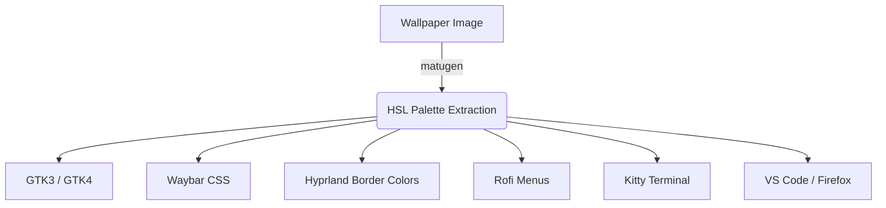

# Desktop Environment & Interface Configuration

This reference covers the Hyprland Wayland compositor, Matugen theming engine, status bar, and complete keybinding matrices.

## Display Manager & Startup

> [!NOTE]
> The system boots directly to a console-based display manager before launching the Wayland session.

*   **Service**: `greetd` + `tuigreet`
*   **Security**: Authenticated via PAM (`security.pam.services.hyprlock`), with `polkit` enabled for privilege escalation.
*   **Portals**: `xdg-desktop-portal-gtk` acts as the primary implementation (`xdg.portal.config.common.default = "*"`).

## Dynamic Theming Engine (Matugen)

Matugen extracts primary, secondary, and tertiary colors from the current wallpaper to dynamically style the entire desktop environment.

> [!TIP]
> To cycle the wallpaper and instantly regenerate all system themes, press `SUPER + SHIFT + W`.

## Firefox High-Performance Engine

The `user.js` is heavily customized for maximum performance and strict privacy.

> [!IMPORTANT]
> A 1GB in-RAM cache is strictly allocated to allow instant switching between heavily loaded tabs without disk trashing.

*   **GPU Acceleration**: `gfx.webrender.all`, `gfx.webrender.compositor`, and `media.ffmpeg.vaapi.enabled` are strictly enabled.
*   **Memory Cache**: `browser.cache.memory.enable` (capacity: 1048576).
*   **Telemetry**: Completely disabled (`DisableFirefoxStudies`, `DisablePocket`).

## Default Applications (XDG MIME Handlers)

| File Type | Application |
| :--- | :--- |
| **PDF** | Zathura |
| **Images** | Loupe |
| **Videos** | VLC Media Player |
| **Office/Docs** | LibreOffice Suite |
| **Web / HTTP** | Firefox |
| **3D Printing** | Lychee Slicer |

## Hyprland Window Rules

Specific applications bypass standard tiling behaviors:

*   **Floating Windows**: `pwvucontrol`, GNOME Calendar, Network TUI, and the `scratchpad` terminal always open floating and centered.
*   **Gaming Latency Bypass**: All `steam_app_*` windows have animations, shadows, and blur entirely disabled to eliminate compositor latency overhead.
*   **Notification Focus Activation**: `misc.focus_on_activate` is enabled so clicking desktop notifications (via SwayNC / `xdg-activation-v1`) switches to the relevant workspace and focuses the window.

## Screen Locking (Hyprlock & Hypridle)

> [!WARNING]
> Monitors are aggressively shut off (`dpms off`) after 30 minutes of inactivity to prevent OLED burn-in.

*   **Lock Screen (15 min)**: `hyprlock` engages using a live desktop screenshot heavily blurred (3 passes, size 8).
*   **Monitor Sleep (30 min)**: `hypridle` triggers `dpms off`.

## Status Bar (Waybar)

The Waybar configuration utilizes Matugen CSS variables and custom widgets.

*   **Layout**: Workspaces and submap indicators (Left) / Clocks and Pomodoro (Center) / MPRIS, SysInfo, Network, and System Tray (Right).
*   **Ambient AI**: A custom block displays rotating background AI tips parsed from the `ai_ambient.sh` script.

## Keybinding Matrix (`SUPER`)

### General Windows & Apps
| Keys | Action |
| :--- | :--- |
| `SUPER + RETURN` | Launch Kitty |
| `SUPER + B` | Launch Firefox |
| `SUPER + Q` | Close active window |
| `SUPER + F` | Toggle floating mode |
| `SUPER + M` | Toggle pseudo-fullscreen |

### Split/Resize Submap Mode (`SUPER + R`)
> [!NOTE]
> Pressing `SUPER + R` enters submap mode. Press `Escape` or `Return` to exit.

| Keys | Action in Submap |
| :--- | :--- |
| `1` / `2` / `3` / `4` / `5` | Resize width to 25%, 33%, 50%, 66%, 75% |
| `H` | Resize height to 50% |
| `6` / `F` | Toggle pseudo-fullscreen |

### System Menus & Screenshots
| Keys | Action |
| :--- | :--- |
| `SUPER + ESCAPE` | Open Rofi Power Menu |
| `SUPER + L` | Lock screen |
| `SUPER + SHIFT + W` | Cycle Wallpaper & Theme |
| `Print` | Region screenshot to clipboard (`grim` + `slurp`) |
| `SHIFT + Print` | Fullscreen screenshot |

### AI Integration
| Keys | Action |
| :--- | :--- |
| `SUPER + SPACE` | Spotlight Search (Apps & AI Fallback) |
| `SUPER + A` | Open Rofi AI Assistant |
| `SUPER + ALT + N` | Trigger AI Notification Digest |
| `SUPER + SHIFT + S` | Capture Region + AI Multimodal Vision Analysis |

### Hardware & Volume (OSD Overlays)
| Keys | Action |
| :--- | :--- |
| `XF86AudioRaiseVolume` | Raise volume (+OSD) |
| `XF86AudioLowerVolume` | Lower volume (+OSD) |
| `XF86AudioMute` | Toggle Audio Mute (+OSD) |
| `XF86MonBrightnessUp` | Brightness Up (+OSD) via `ddcutil` |
| `XF86MonBrightnessDown`| Brightness Down (+OSD) via `ddcutil` |
