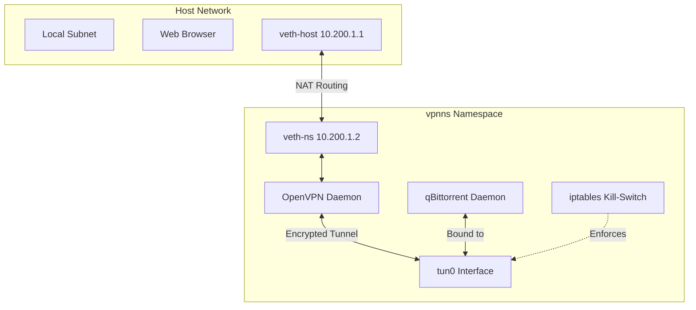

# Networking, Security & VPN Namespace

This document outlines the host networking configuration, mesh VPNs (Tailscale), file synchronization (Syncthing), and the strict Linux Network Namespace (`vpnns`) used to isolate torrent traffic.

## Host Networking Infrastructure

*   **DNS Resolution**: Cloudflare Secure DNS (`1.1.1.1`, `1.0.0.1`).
*   **Firewall**: System ingress firewall is enabled by default.
*   **Mesh VPN**: Tailscale is enabled, and `tailscale0` is trusted by the firewall to allow seamless multi-device connectivity.
*   **Syncthing**: Decentralized file sync runs as the local user, syncing `/home/justkowal/Sync`.

## Isolated Network Namespace (`vpnns`)

To guarantee absolute privacy and prevent DNS or IP leaks, torrent traffic is isolated inside a dedicated Linux Network Namespace.

> [!CAUTION]
> Traffic originating inside `vpnns` cannot escape to the host network unless it is traversing the encrypted `tun0` interface.



### Namespace Architecture

*   **Virtual Ethernet Pairs**: `veth-host` on the host side routes NAT traffic to `veth-ns` inside the namespace (`10.200.1.0/24` subnet).
*   **DNS**: Forced to Cloudflare (`1.1.1.1`) inside the namespace via `/etc/netns/vpnns/resolv.conf`.
*   **iptables Kill-Switch**:
    *   Default policy drops ALL traffic.
    *   Allows loopback (`lo`).
    *   Allows traffic on the `tun+` interface.
    *   Allows traffic bound for the local `10.200.1.0/24` subnet (to permit WebUI access from the host browser).

### OpenVPN & qBittorrent

> [!IMPORTANT]
> The `qbittorrent` systemd service is explicitly bound to the `vpnns-openvpn.service` and executes inside `/var/run/netns/vpnns`.

*   **OpenVPN**: Runs continuously inside `vpnns`, establishing the `tun0` tunnel using `openvpn-config.ovpn`.
*   **qBittorrent (Headless)**: Binds exclusively to `tun0`. The WebUI operates on port `8080`, allowing the host browser to connect.

### GUI Application Wrapper

To launch applications inside the VPN namespace with full GUI support (X11/Wayland variables passed through):

```bash
# Launches the qbittorrent GUI inside the namespace
qbittorrent-vpn
```

This is facilitated by a targeted `sudo` rule allowing passwordless execution of `ip netns exec vpnns`.
