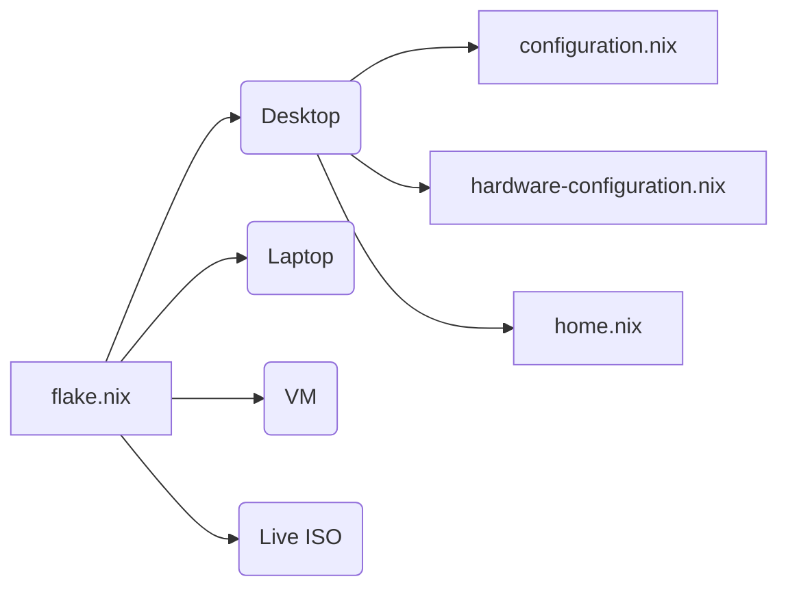
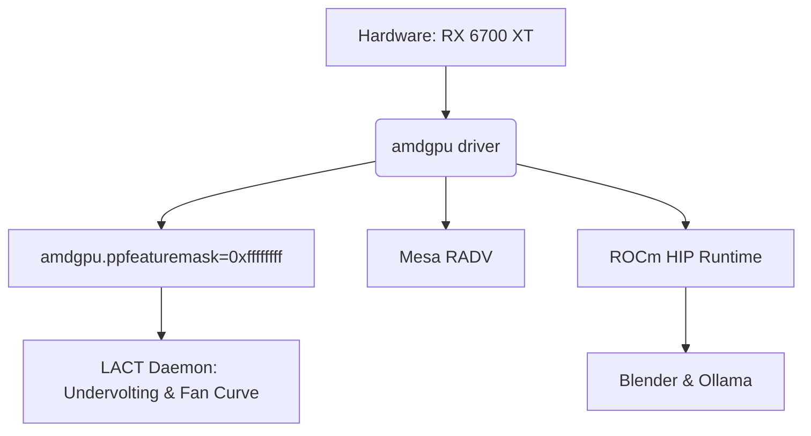

# System Architecture & Kernel Configuration

This document outlines the core architecture of the `/etc/nixos` Flake, host targets, bootloader, kernel compilation parameters, and system tuning.

> [!NOTE]
> All host configurations import a shared set of base modules from `/etc/nixos/modules`, but define their own hardware profiles, filesystems, and deployment targets.

## Flake Architecture

### Host Targets Matrix

| Target | Description | Profile |
| :--- | :--- | :--- |
| **`desktop`** | Primary AMD Ryzen + Radeon RX 6700 XT workstation. | Bcachefs, XanMod LTO Kernel, Full UI, AI Suite. |
| **`laptop`** | Portable devices with battery management (TLP/auto-cpufreq). | Standard ext4, Power-saving config. |
| **`vm`** | QEMU/KVM guest target with SPICE agent integration. | Virtualized drivers, reduced bloat. |
| **`iso`** | Live bootable ISO target equipped with a custom TUI installation wizard. | Ephemeral root, installer scripts. |

## Bootloader & Storage

> [!IMPORTANT]
> The ESP Random Seed service is explicitly disabled (`systemd-boot-random-seed.enable = false`) to eliminate VFAT write sync delays during boot.

*   **Bootloader**: `systemd-boot` with 0-second timeout.
*   **Filesystem**: Root (`/`) is Bcachefs with `zstd` compression. EFI (`/boot/efi`) is `vfat`.
*   **Scrubbing**: Bcachefs `fsck` runs automatically on a weekly systemd timer (`bcachefs-scrub`).
*   **Initrd**: Highly pruned module set with `zstd` compression for fast, silent boot (`includeDefaultModules = false`).

## XanMod Custom Kernel Compilation

The desktop profile compiles a custom trimmed Linux kernel derived from `linuxPackages_xanmod_latest`.

> [!WARNING]
> Building this kernel from scratch can take significant time depending on the builder machine's core count.

*   **Toolchain**: Clang/LLVM (`stdenv = llvmPackages_latest.stdenv`).
*   **Flags**: `-march=znver3` and `-mtune=znver3` (optimized for AMD Zen 3).
*   **LTO**: Thin Link-Time Optimization (`LTO_CLANG_THIN = yes`).
*   **Scheduler**: Full preemption (`PREEMPT = yes`), 1000 Hz timer (`HZ_1000 = yes`), Autogroup disabled.
*   **Pruning**: All unused networking, wireless, hypervisor, and GPU subsystems are stripped. Only `AMDGPU` and essential USB/Storage drivers are compiled.

## AMD GPU Setup & ROCm

> [!CAUTION]
> The Navi 22 GPU (`gfx1031`) is spoofed as `gfx1030` using `HSA_OVERRIDE_GFX_VERSION="10.3.0"` to ensure ROCm compatibility with Blender and Ollama.

## Performance Tuning

*   **zramSwap**: Algorithm `zstd`, `50%` memory limit, priority `10`.
*   **D-Bus**: `dbus-broker` is utilized instead of the legacy daemon.
*   **Networking**: TCP BBR congestion control enabled, large send/receive buffers (16MB).
*   **Disk Schedulers**:
    *   NVMe: `none`
    *   SATA SSD: `kyber`
    *   HDD: `bfq`
*   **Process Priority**: Ananicy-cpp handles dynamic `nice` adjustments using CachyOS community rules.

## Audio & Realtime Limits

PipeWire is the core audio daemon, replacing PulseAudio and JACK.

> [!NOTE]
> The `@audio` PAM group is granted realtime priority (`rtprio = 99`), unlimited memlock, and `nice = -19` to guarantee stutter-free audio production.

*   **Sample Rate**: `48000 Hz`
*   **Quantum Range**: Min `32`, Max `1024` (Default `64` for ~1.33ms latency).

## System Minimalization

Boot-blocking network waits and unnecessary crash dumps are disabled.

*   **Journald**: Volatile storage (logs in RAM `/run/log/journal`), capped at 50MB.
*   **NetworkManager**: `NetworkManager-wait-online.service` is disabled.
*   **Coredumps / OOMD**: Both `systemd.coredump` and `systemd.oomd` are disabled.
